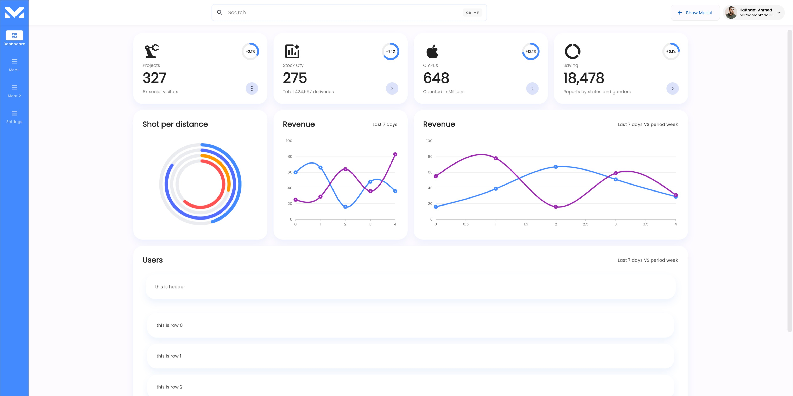
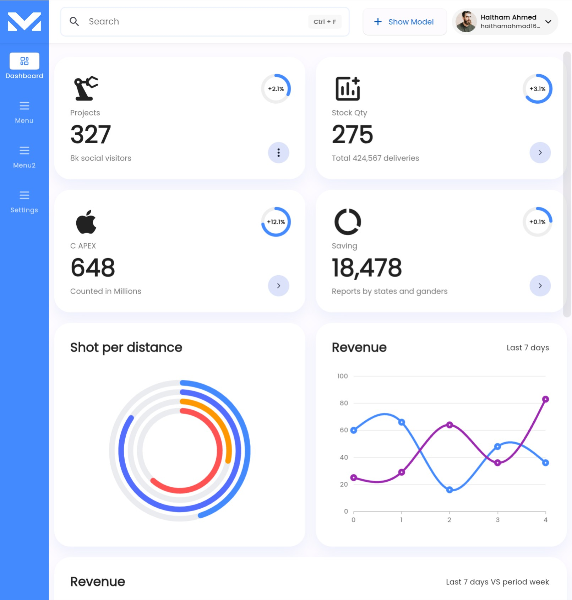
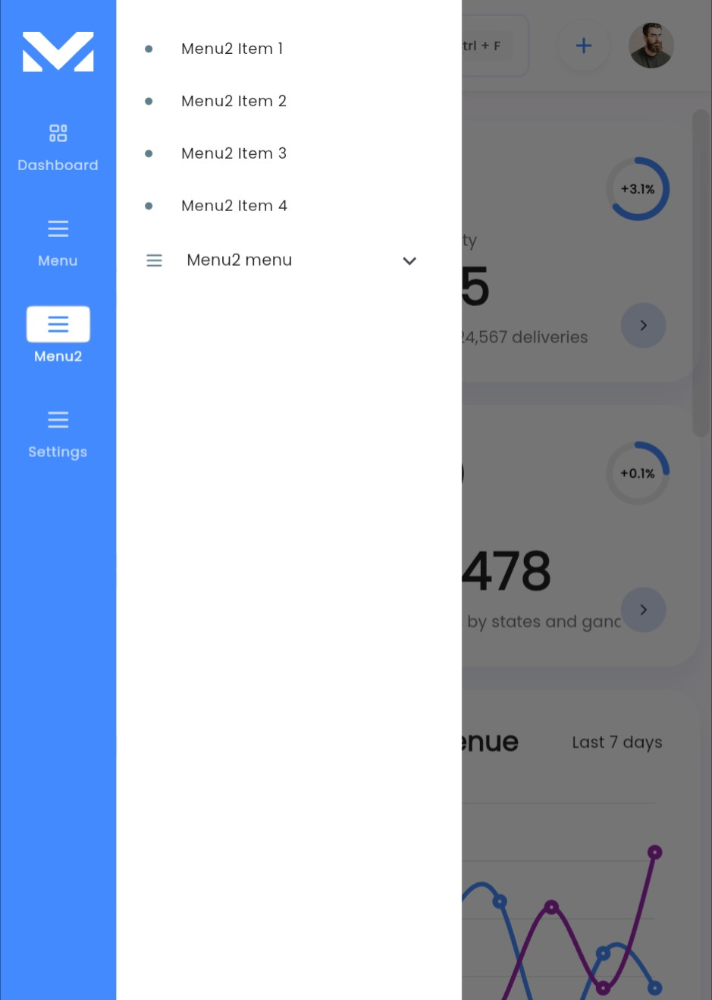
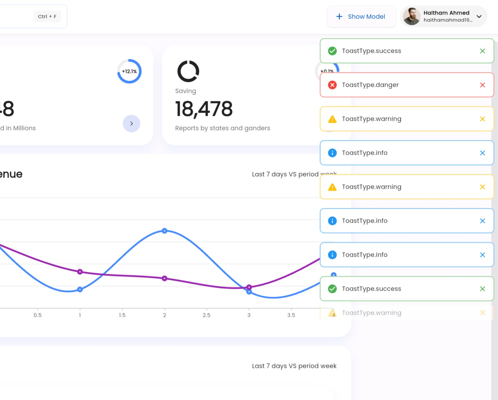
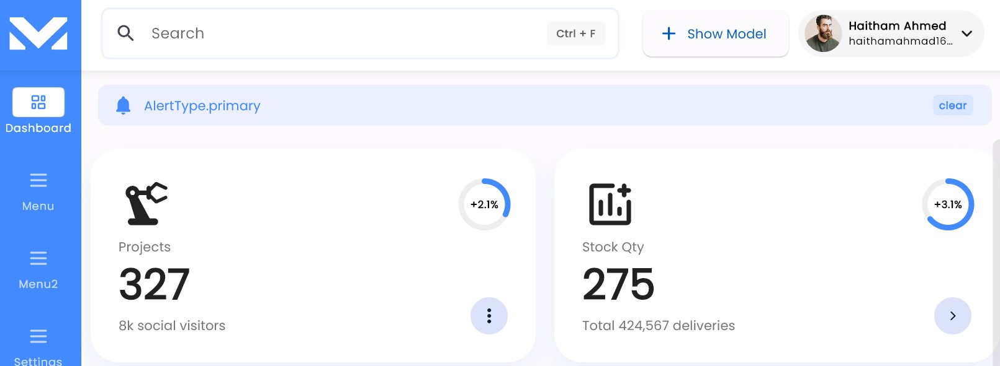

# Flutter Dashboard

[](LICENSE.md)
[](https://flutter.dev)

## Description

Flutter cross-platform dashboard

## Demo

Daily updates

- [codestein.dev](https://codestein.dev/)

## Table of Contents

- [Screenshots](#screenshots)
- [Features](#features)
- [Installation](#installation)
- [Dependencies we use](#dependencies-we-use)
- [Support me](#support-me)
- [Contributing](#contributing)
<!-- - [Usage](#usage)

- [Dependencies](#dependencies)

- [License](#license) -->

## Screenshots

Dashboard



Dashboard tablet size



2 Drawer and mobile size



Toast and Alert system ready




## Features

will be listed soon

## Installation

```bash
# Clone the repository
git clone https://github.com/haitham-alabdullah/flutter-dashboard.git

# Navigate to the project directory
cd dashboard

# Install dependencies
flutter pub get

# Run the project
flutter run
```

## Dependencies we use

- [get: ^4.6.5](https://pub.dev/packages/get)
- [vector_math: any](https://pub.dev/packages/vector_math)
- [google_fonts: ^5.1.0](https://pub.dev/packages/google_fonts)
- [flutter_svg: ^2.0.7](https://pub.dev/packages/flutter_svg)
- [flutter_staggered_grid_view: ^0.7.0](https://pub.dev/packages/flutter_staggered_grid_view)
- [flutter_staggered_animations: ^1.1.1](https://pub.dev/packages/flutter_staggered_animations)
- [syncfusion_flutter_charts: ^22.2.11](https://pub.dev/packages/syncfusion_flutter_charts)
- [flutter_breadcrumb: ^1.0.1](https://pub.dev/packages/flutter_breadcrumb)

## Support me

[](https://www.buymeacoffee.com/HaithamDev)

## Contributing

no contributing yet
