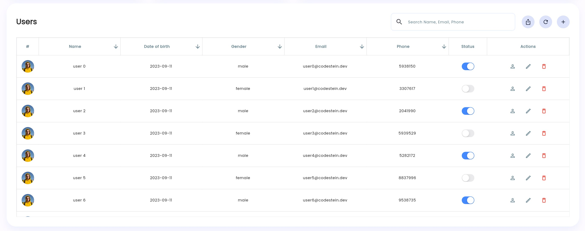

# Flutter Dashboard

[](LICENSE.md)
[](https://flutter.dev)

## Description

Flutter cross-platform dashboard

## Demo

Daily updates

- [codestein.dev](https://codestein.dev/)

## Table of Contents

- [Screenshots](#screenshots)
- [Features](#features)
- [Installation](#installation)
- [Dependencies we use](#dependencies-we-use)
- [Support me](#support-me)
- [Contributing](#contributing)
<!-- - [Usage](#usage)

- [Dependencies](#dependencies)

- [License](#license) -->

## Screenshots

Dashboard


Dashboard tablet size


2 Drawer and mobile size


Toast and Alert system ready


Data Tables



## Features

will be listed soon

## Installation

```bash
# Clone the repository
git clone https://github.com/haitham-alabdullah/flutter-dashboard.git

# Navigate to the project directory
cd dashboard

# Install dependencies
flutter pub get

# Run the project
flutter run
```

## Dependencies we use

- [get: ^4.6.5](https://pub.dev/packages/get)
- [vector_math: any](https://pub.dev/packages/vector_math)
- [google_fonts: ^5.1.0](https://pub.dev/packages/google_fonts)
- [flutter_svg: ^2.0.7](https://pub.dev/packages/flutter_svg)
- [flutter_staggered_grid_view: ^0.7.0](https://pub.dev/packages/flutter_staggered_grid_view)
- [flutter_staggered_animations: ^1.1.1](https://pub.dev/packages/flutter_staggered_animations)
- [syncfusion_flutter_charts: ^22.2.11](https://pub.dev/packages/syncfusion_flutter_charts)
- [syncfusion_flutter_datagrid: ^22.2.11](https://pub.dev/packages/syncfusion_flutter_datagrid)
- [flutter_breadcrumb: ^1.0.1](https://pub.dev/packages/flutter_breadcrumb)

## Support me

[](https://www.buymeacoffee.com/HaithamDev)

## Contributing

no contributing yet

## License

```bash
MIT License

Copyright (c) 2023 Haitham Alabdullah

Permission is hereby granted, free of charge, to any person obtaining a copy
of this software and associated documentation files (the "Software"), to deal
in the Software without restriction, including without limitation the rights
to use, copy, modify, merge, publish, distribute, sublicense, and/or sell
copies of the Software, and to permit persons to whom the Software is
furnished to do so, subject to the following conditions:

The above copyright notice and this permission notice shall be included in all
copies or substantial portions of the Software.

THE SOFTWARE IS PROVIDED "AS IS", WITHOUT WARRANTY OF ANY KIND, EXPRESS OR
IMPLIED, INCLUDING BUT NOT LIMITED TO THE WARRANTIES OF MERCHANTABILITY,
FITNESS FOR A PARTICULAR PURPOSE AND NONINFRINGEMENT. IN NO EVENT SHALL THE
AUTHORS OR COPYRIGHT HOLDERS BE LIABLE FOR ANY CLAIM, DAMAGES OR OTHER
LIABILITY, WHETHER IN AN ACTION OF CONTRACT, TORT OR OTHERWISE, ARISING FROM,
OUT OF OR IN CONNECTION WITH THE SOFTWARE OR THE USE OR OTHER DEALINGS IN THE
SOFTWARE.
```
